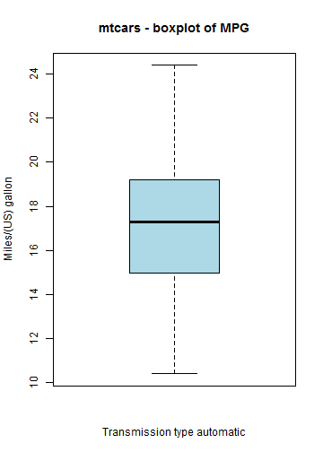
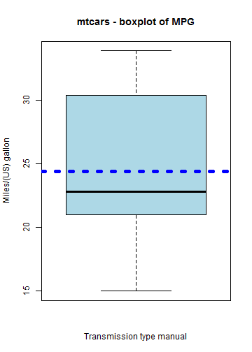

## Overview 

The shinyapp was developed to showcase an interactive application, using mtcars dataset.  
The application displays a boxplot of miles per gallon and highlights the mean.  
The slider is used to choose the subset of data based on Trasmission type 0 - automatic and 1 - manual.  
A choice of radio buttons help choose the color of the line used to highlight the median.


--- .class #id 
## Links

The shiny app is accessible at 
https://steve-nathan.shinyapps.io/shinyapp2/

The code for the shiny app is at Github at 
https://github.com/steve-nathan/shinyapp2


--- .class #id 

## Plot Transmission type automatic


```r
data(mtcars)
mtcars1 <- subset(mtcars, am == 0)
boxplot(mtcars1$mpg, ylab = "Miles/(US) gallon", xlab = "Transmission type automatic", 
    col = "lightblue", main = "mtcars - boxplot of MPG")
```

 

```r
meanmpg = mean(mtcars1$mpg)
```


--- .class #id 

## Plot Transmission type manual


```r
mtcars1 <- subset(mtcars, am == 1)
boxplot(mtcars1$mpg, ylab = "Miles/(US) gallon", xlab = "Transmission type manual", 
    col = "lightblue", main = "mtcars - boxplot of MPG")
```

 

```r
meanmpg = mean(mtcars1$mpg)
```


--- .class #id 
## Summary
In the shiny application we used two widgets to demonstrate the interactive capability.  

Slider :- 
        sliderInput('type', 'Choose Transmission type:- 0 = automatic, 1 = manual',value = 0, min = 0, max = 1, step = 1),
        
Radio Button :-
        radioButtons("color", label = h3("Color"),
                     choices = list("Red" = "red",
                                    "Blue" = "blue",
                                    "Green" = "green")
                     ,selected = "red")

By combining widgets, Applications can be developed to make it interactive and engaging.


